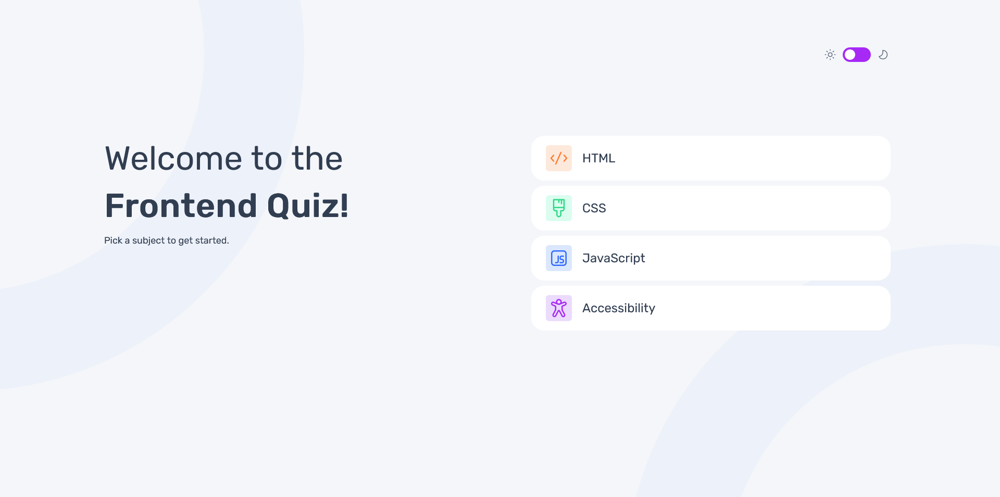

# Frontend Mentor - Frontend quiz app solution

## Table of contents

- [Overview](#overview)
  - [The challenge](#the-challenge)
  - [Screenshot](#screenshot)
  - [Links](#links)
- [My process](#my-process)
  - [Built with](#built-with)
  - [What I learned](#what-i-learned)
  - [Continued development](#continued-development)
  - [Useful resources](#useful-resources)
- [Author](#author)


## Overview

### The challenge

Users should be able to:

- Select a quiz subject
- Select a single answer from each question from a choice of four
- See an error message when trying to submit an answer without making a selection
- See if they have made a correct or incorrect choice when they submit an answer
- Move on to the next question after seeing the question result
- See a completed state with the score after the final question
- Play again to choose another subject
- View the optimal layout for the interface depending on their device's screen size
- See hover and focus states for all interactive elements on the page
- Navigate the entire app only using their keyboard

### Screenshot



### Links

- Solution URL: [Github repository](https://github.com/Jhannet/frontend-quiz-app)
- Live Site URL: [Github pages live site](https://jhannet.github.io/)

## My process

### Built with

- Semantic HTML5 markup
- CSS custom properties
- Flexbox
- CSS Grid
- JavaScript
- [JQuery](https://releases.jquery.com/)

### What I learned

I learned to create a html structure for a page from scratch, considering tags like header, aside and to create div containers for main sections.\
I used CSS grid layout to align positions of main elements of the page structure and with @media I defined styles for different device sizes.\
I added a font style for all the pages with local font style files.\
To design icons I used css properties to set special borders and background colors, I used flexbox to align the content.
```css
.option-icon {
    height: 40px;
    width: 40px;
    background-color: #F4F6FA;
    display: flex;
    align-items: center;
    justify-content: center;
}

.option-icon strong {
    color: inherit;
    text-align: center;
}
```
With Javascript and JQuery I loaded data dynamically and set them on the pages in a determined moment, implementing all the required functionality.\
To pass data from a page to another I did it using url params.\
For animations I used css properties like :hover, :active, :focus and :checked and with JQuery adding and removing elements and css classes.\
With JQuery I implemented event listeners, to set functionality for some elements.
```js
$(`#option-${selectedOption}`).addClass("wrong-answer");
$(`#option-${selectedOption} .option-icon`).addClass("error-color");
$(`#option-${selectedOption} .menu-item-container`).append(`<div class="error-icon"><strong>x</strong></div>`);
```
I learned about accessibility and implemented it with tabindex attributes in 'a' tags.\
I learned to write code for many of the same css classes just in one statement block.

### Continued development

I need to learn or improve:
- Best practices to structure pages from scratch
- How to use global variables in css to have better manipulation when changing a thing in different parts like colors, sizes
- Improve to pass data from a page to another
- When create a new html page
- Create clean components to reuse them

### Useful resources

- [Using JQuery](https://learn.jquery.com/using-jquery-core/) - This page has the necessary documentation of JQuery with simple examples.
- [Keyboard accessibility](https://www.smashingmagazine.com/2022/11/guide-keyboard-accessibility-html-css-part1/) - This helped me to learn about Accessibility and how to apply it.
- [CSS grid layout](https://developer.mozilla.org/es/docs/Web/CSS/CSS_grid_layout) - This page helped me to understand CSS grid basic concepts.
- [Basic concepts of Flexbox](https://developer.mozilla.org/en-US/docs/Web/CSS/CSS_flexible_box_layout/Basic_concepts_of_flexbox) - This page helped me to understand Flexbox concepts.
- [W3 schools - CSS tutorial](https://www.w3schools.com/css/default.asp) - This page helped me to understand css concepts with basic examples.

## Author

- Github - [Jhannet Jancko](https://github.com/Jhannet)
- Frontend Mentor - [@Jhannet](https://jhannet.github.io/)

